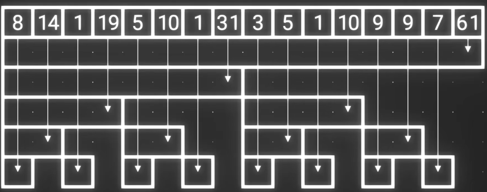

### 以下用来探讨对 树状数组 的一些理解 仅供参考

树状数组在我看来和前缀和有很高的相似度,不如说是前缀和是用到了树状数组的,
相比于普通的数组,其查询和更新的复杂都为 
$$O(\log n)$$
其能快速计算前缀和
虽然如此,但是树状数组的访问和构建并非简易,因为它涉及到了二进制位的计算
比如我想要得到原数组第```2```位存的元素是什么,那么我就得用第```2```位的元素的前缀和减去第```1```位元素的前缀和,才能得到结果

现在若要将下面这个数组a[]变为树状数组

最终成果将会是


构造一个树状数组所需要的变量如下:

```cpp
#define lowbit(x) x&(-x) //用于返回x二进制中最低有效位(1)
const int maxN;
vector<int>tree(maxN,0);
int n;//原数组大小
```
- 其中宏定义lowbit ,能够将```x```和```-x```的二进制进行求并集,而正巧一个数的补码正好就是这个数的所有位取反后再加1,在求并后正好留下了最低位有效位
例如```x = 6```的二进制表示是```0110```
在```0110```取反后得到```1001```,再加上```1```得到```1010```(即```-x```)
两者求并得到```0010```
<br>

```update()```函数能够对树状数组中的某个点进行更新,从某个点开始一直向上更新
 - 比如如果更新点```idx = 1``` 则每次在```tree[idx]```更新后,```idx```会加上```1,2,4,8,16,32,...```直到```idx >= n```
  
```cpp
void update(int idx,int val)//从下至上进行单点更新
{
    while(idx <= n)
    {
        tree[idx]+=val;
        idx += lowbit(idx);
    }
}
```
<br>
<br>

```query()```函数则可以得到单点```idx```的前缀和,从```idx```一直向下求和
- 比如如果在```idx = 33```处求前缀和,则每次在```sum```加和后,```idx```将会减去```1,32```直到等于```0```
```cpp
int query(int idx)//从上至下可以找到idx的前缀和(1-x的和)
{
    int sum = 0;
    while(idx > 0)
    {
        sum += tree[idx];
        idx -= lowbit(idx);
    }
    return sum;
}
```

<br>
<br>

下面给出在```main```函数用数组```arr```构建出一个树状数组的过程
```cpp
int main()
{
    arr[]={8,6,1,4,5,5,1,1,3,2,1,4,9,0,7,4};
    for(int i=1; i <= n; i++)
        update(i,arr[i]);
    //现在我想要取得原第二位元素的值
    int elementAt2 = query(2)-query(1);//第二位的前缀和减去第一位的前缀和
    cout << elementAt2;   
}
```